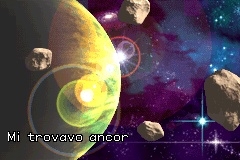
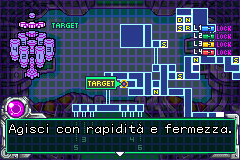
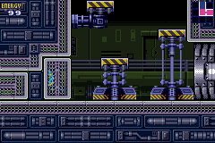
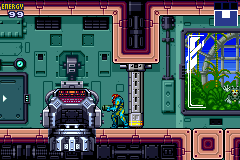

# Metroid Fusion - European Vanilla+

**English** | [Italiano](README.it.md)

Unofficial patch for the European version of *Metroid Fusion* on Game Boy Advance, with revised colors and a few changes to reduce waiting time.

The European game already includes Italian. This patch preserves the original text and does not change movement, combat or progression.

## Download

The v1.0.0 patch and checksum are on the [Releases](https://github.com/Bruc3Dev573/metroid-fusion-vanilla-plus/releases) page. The separate `source.zip` archive on that page contains the files needed to rebuild it.

## Included changes

- **[Color Palette Improvement](https://www.romhacking.net/hacks/8122/)** by Piggy Chan!, using ShadowOne333's [European port](https://github.com/ShadowOne333/Metroid-Fusion-Redux/blob/e7da0d65bb3186e6ed2a5ec02d9602213bf3c79a/code/ColorImprovement/color_improvement_eur.asm). Revises environment and character palettes, including Samus's suits.
- **[Fast Text](https://github.com/ShadowOne333/Metroid-Fusion-Redux/blob/e7da0d65bb3186e6ed2a5ec02d9602213bf3c79a/code/misc.asm#L114-L126)** by SpineShark. Speeds up navigation dialogue text.
- **[Faster Door Transitions](https://metroidconstruction.com/resource.php?id=414)** by Jumzhu, with the [odd-distance correction](https://github.com/ShadowOne333/Metroid-Fusion-Redux/blob/e7da0d65bb3186e6ed2a5ec02d9602213bf3c79a/code/faster_door_transitions.asm) by somerando/caauyjdp.
- **[Faster Elevators](https://github.com/ShadowOne333/Metroid-Fusion-Redux/blob/e7da0d65bb3186e6ed2a5ec02d9602213bf3c79a/code/faster_elevators.asm)** by interdpth. Speeds up elevator travel.
- **Start-to-skip introduction**, implemented for the European ROM by Bruc3Dev573, using the [Redux modification](https://github.com/ShadowOne333/Metroid-Fusion-Redux/blob/e7da0d65bb3186e6ed2a5ec02d9602213bf3c79a/code/misc.asm#L4-L6) as a reference. Without Start, the introduction plays normally.

There is one combined patch, applied directly to the clean ROM. It does not include Better Suits Colours, Adam dialogue skip, single-wall jumping, infinite bomb jumping or unlocked doors. It is not the full Redux patch. The recolor reflects its author's choices, not an official color restoration.

## Required ROM

| Property | Expected value |
|---|---|
| Title | `Metroid Fusion (Europe) (En,Fr,De,Es,It)` |
| Game code | `AMTP` |
| Revision | `0` |
| Size | `8388608` bytes |
| CRC32 | `974e46ab` |
| SHA-1 | `cc46d54b70c1ee38c856ee6e58ec712136763389` |
| SHA-256 | `a024ef6fa8ff19444bc6c31a714eb6cab44464b39227fcd434e409fca1cd8198` |

Do not apply the patch to the USA or Japanese releases, or to an already modified ROM.

## Installation

1. Check the ROM against the hashes above and keep a backup of the original.
2. Apply [`metroid-fusion-vanilla-plus-eu-v1.0.0.ips`](patches/metroid-fusion-vanilla-plus-eu-v1.0.0.ips) with [Lunar IPS](https://fusoya.eludevisibility.org/lips/) or another IPS patcher. Save the result to a new file.
3. Compare the patched ROM's SHA-256 with the value below.
4. Start the game and select your language.

The IPS format does not check the base ROM for you. The patched ROM remains 8 MiB.

| File | SHA-256 |
|---|---|
| IPS patch | `03f15ebaf6939ad58c4c977113866d29b0a751a400685f1c0064d8365dc0f728` |
| Patched ROM | `fd211f006f81ef2ce3ea09de94831a4a1b33b2e87702618fa6c18b1eedf11312` |

Hashes are also listed in [`release.json`](release.json) and the `.sha256` file alongside the IPS.

## Verification

Rebuilding the patch and applying it to the clean ROM produce the same result. Checks covered fast text, doors and elevators, including the odd distances that caused problems in the original faster-door modification.

BizHawk checks covered the full introduction, Start skips at two different points, two door crossings and an elevator route. In the compared cases, the save after the introduction was identical to the unmodified game's save. The Habitation terminal was observed in a prepared test scene, with no disappearance during its inactive animation cycle.

These are targeted checks, not a full playthrough. The patch has not been tested on a physical GBA or MiSTer.

Report problems through [Issues](https://github.com/Bruc3Dev573/metroid-fusion-vanilla-plus/issues), including the ROM hash, emulator or core, and location in the game. Do not attach ROMs or personal saves.

## Screenshots

Captured from the patched ROM in BizHawk at 240 x 160 pixels.

| Introduction in Italian | Navigation dialogue |
|:---:|:---:|
|  |  |
| **Samus and the station** | **Habitation terminal** |
|  |  |

## Credits

- **Bruc3Dev573:** European integration, EU intro-skip code, build tools, testing and patch packaging.
- **Piggy Chan!:** [Color Palette Improvement](https://www.romhacking.net/hacks/8122/).
- **ShadowOne333:** [European palette port](https://github.com/ShadowOne333/Metroid-Fusion-Redux/blob/e7da0d65bb3186e6ed2a5ec02d9602213bf3c79a/code/ColorImprovement/color_improvement_eur.asm) and the [intro-skip reference](https://github.com/ShadowOne333/Metroid-Fusion-Redux/blob/e7da0d65bb3186e6ed2a5ec02d9602213bf3c79a/code/misc.asm#L4-L6).
- **SpineShark:** [Fast Text](https://github.com/ShadowOne333/Metroid-Fusion-Redux/blob/e7da0d65bb3186e6ed2a5ec02d9602213bf3c79a/code/misc.asm#L114-L126).
- **Jumzhu:** [Faster Door Transitions](https://metroidconstruction.com/resource.php?id=414).
- **somerando/caauyjdp:** [odd-distance door correction](https://github.com/ShadowOne333/Metroid-Fusion-Redux/blob/e7da0d65bb3186e6ed2a5ec02d9602213bf3c79a/code/faster_door_transitions.asm).
- **interdpth:** [Faster Elevators](https://github.com/ShadowOne333/Metroid-Fusion-Redux/blob/e7da0d65bb3186e6ed2a5ec02d9602213bf3c79a/code/faster_elevators.asm).
- **yohann:** intro-skip research acknowledged in the [original Redux credits](https://github.com/ShadowOne333/Metroid-Fusion-Redux/blob/e7da0d65bb3186e6ed2a5ec02d9602213bf3c79a/ReadMe.md#credits).
- **Nintendo:** original game, artwork and text.

Attribution and redistribution terms for original project material are in [`NOTICE`](NOTICE).

## Disclaimer

This is an unofficial, noncommercial fan project, provided without warranty. Nintendo and the original patch authors are not involved in this European integration. A legitimate copy of the game is required.

This repository contains patches, checksums, screenshots and documentation. It contains no ROMs or saves. The code needed to rebuild the patch is supplied separately with the release. Rights holders and original authors may request corrections, credit changes or removal through [GitHub Issues](https://github.com/Bruc3Dev573/metroid-fusion-vanilla-plus/issues).
